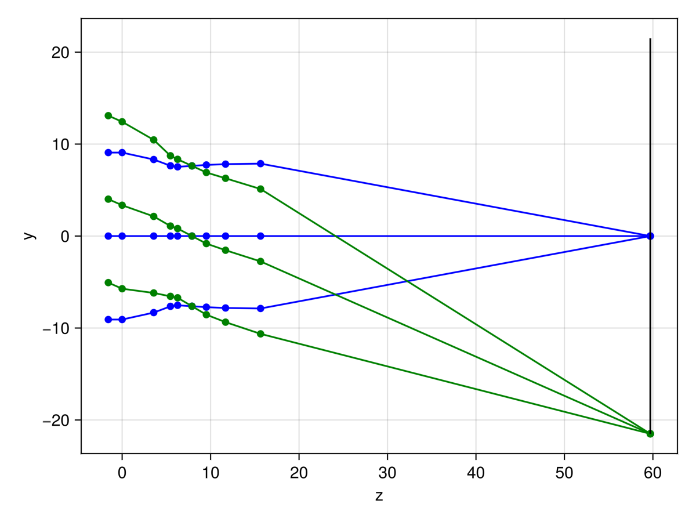

# OpticalRayTracing.jl

Basic first order paraxial ray tracing and optical system solving.

----

This minimal package is meant to be an initial design prototyping tool aimed at providing an alternative to more traditional YNU spreadsheet solvers.

## Installation

```julia
using Pkg
Pkg.add(url = "https://github.com/Sagnac/OpticalRayTracing.jl")
```

## Sample usage

```julia
using OpticalRayTracing

# Tessar lens, units in mm; prescription from Hecht's Optics
surfaces = [
    # R        t        n
    Inf        0.0      1.0;
      16.28    3.57     1.6116;
    -275.7     1.89     1.0;
     -34.57    0.81     1.6053;
      15.82    1.625    1.0;
    Inf        1.625    1.0;
    Inf        2.17     1.5123;
      19.2     3.96     1.6116;
     -24.0     0.0      1.0
]

# Clear semi-apertures
a = [15.0, 15.0, 11.0, 11.0, 7.63, 11.0, 11.0, 11.0]

# image height
h′ = -21.5

system = solve(surfaces, a, h′)

# output

f: 50.7885
EBFD: 44.0610
EFFD: -43.1125
   N: 2.7976
 FOV: 45.8882
stop: 5
  EP: D = 18.1545, t = 7.9184
  XP: D = 18.0683, t = -6.4864

####

julia> system.M[] # vertex transfer matrix
2×2 Matrix{Float64}:
  0.867538   13.3868
 -0.0196895   0.848862
```

## Plotting example

```julia
using GLMakie

julia> rayplot(system)
```


