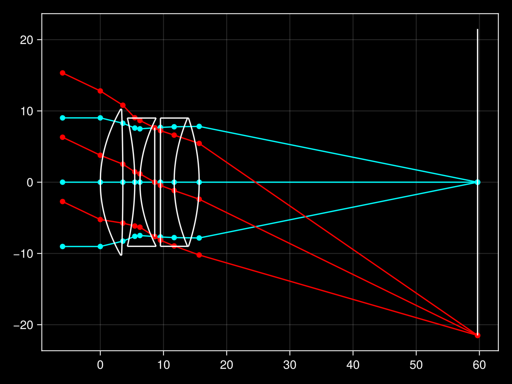

# OpticalRayTracing.jl

Basic first order paraxial ray tracing and optical system solving.

----

This minimal package is meant to be an initial design prototyping tool aimed at providing an alternative to more traditional YNU spreadsheet solvers.

## Installation

```julia
using Pkg
Pkg.add(url = "https://github.com/Sagnac/OpticalRayTracing.jl")
```

## Sample usage

```julia
using OpticalRayTracing

# Tessar lens, units in mm; prescription from Hecht's Optics
surfaces = [
    # R        t        n
    Inf        0.0      1.0;
      16.28    3.57     1.6116;
    -275.7     1.89     1.0;
     -34.57    0.81     1.6053;
      15.82    2.345    1.0;
    Inf        0.905    1.0;
    Inf        2.17     1.5123;
      19.2     3.96     1.6116;
     -24.0     0.0      1.0
]

# Clear semi-apertures
a = [10.25, 10.25, 9.0, 9.0, 7.63, 9.0, 9.0, 9.0]

# image height
h′ = -21.5

system = solve(surfaces, a, h′)
```

```julia
# output

OpticalRayTracing.System

   f: 50.7885
EBFD: 44.0610
EFFD: -43.1125
   N: 2.8140
 FOV: 45.8882
stop: 5
  EP: D = 18.0483, t = 8.9314
  XP: D = 17.6129, t = -5.5024
```

```julia
julia> system.M # vertex matrix
TransferMatrix([0.8675383998011305 13.386798282391975; -0.01968949458327543 0.8488623764668577])
```

## Vignetting analysis

```julia
julia> vignetting(system, a)

Partially vignetted:
[1, 2, 3, 8]


Fully vignetted or limit:
[5]

a        un        half        full
8×4 Matrix{Float64}:
 10.25  12.805    9.02413  9.02413
 10.25  10.8017   8.27315  8.27315
  9.0    9.0471   7.59772  7.59772
  9.0    8.65861  7.48453  7.48453
  7.63   7.63     7.63     7.63
  9.0    8.13925  7.68614  7.68614
  9.0    8.94668  7.77516  7.77516
  9.0   10.2157   7.82878  7.82878
```

## Seidel aberrations

The surface coefficients can be extracted by querying the relevant `WIJK` fields. In addition, chromatic aberration can be quantified for a given `δn` vector.
```julia
julia> aberrations(surfaces, system)
OpticalRayTracing.Aberration

spherical: 16.3806
coma: 3.4316
astigmatism: -15.7483
petzval: 48.9284
distortion: -50.5448
axial: 0.0000
lateral: -0.0000
```

## Plotting example

By default a light theme is used, but this can be tuned with the `theme` keyword argument. `ray_colors` & `surface_color` are supported kwargs as well as anything Makie's `lines` accepts.

```julia
using GLMakie

rayplot(surfaces, system, a)
```


