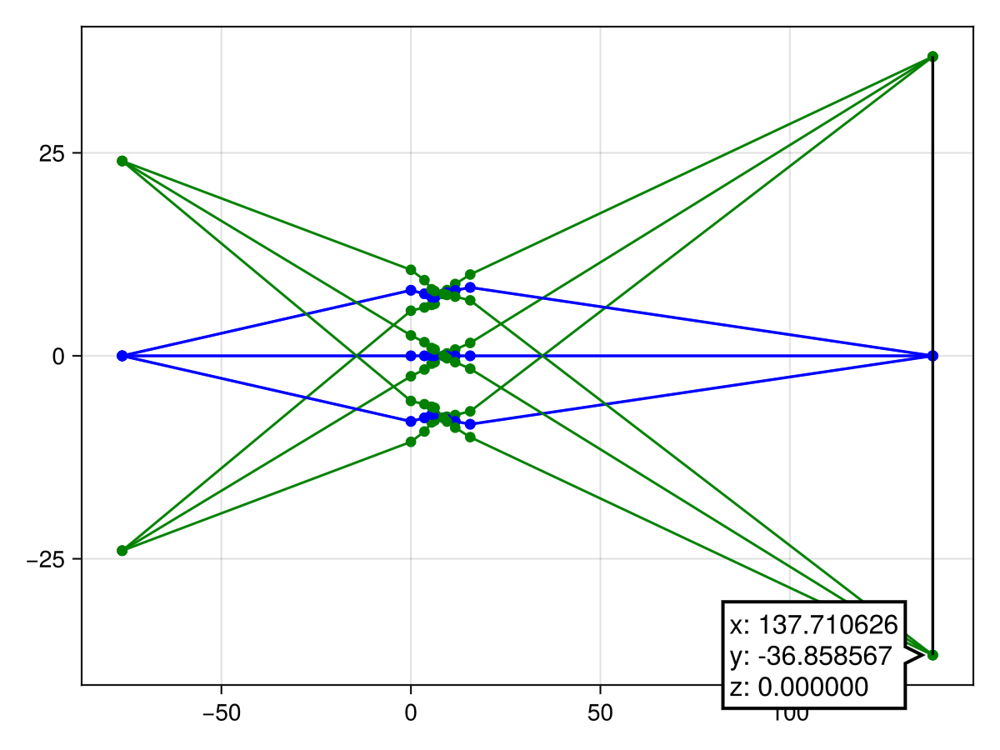

# Plotting Examples

Plotting is supported with the installation of any [Makie](https://github.com/MakieOrg/Makie.jl) backend.

## Ray Trace Plots

Supported keyword arguments are:
* `theme` (using Makie's theme customizability);
* `ray_colors` (a two-tuple of the marginal & chief ray colors);
* `surface_color` (for the optical element surfaces & image plane);
* anything Makie's `lines` accepts.

Using the mutating `rayplot!` version will draw on top of the current figure.

```julia
using GLMakie

surface_color = :white
ray_colors = (:cyan, :red)

rayplot(surfaces, system; theme = theme_black(), surface_color, ray_colors)

rays = raytrace(system, -24.0, -1.5 * system.f)
fig = rayplot(rays)
rays = raytrace(system, 24.0, -1.5 * system.f)
rayplot!(rays)

surface = [Inf 0.0 1.0; -100.0 0.0 -1.0]
system = solve(surface, fill(30.0, 2), 21.0)
# traces real rays
fig = caustic(surface, system; theme = theme_black(), surface_color)
```





## Aberration Plots

The fan plots are interactive and include a slider which allows dynamic adjustment of the field.

```julia
using GLMakie

wavefan(W)
rayfan(W, system)
field_curves(W, system)
percent_distortion(W, system)
spot_size(W, system)
```

|    |    |
|----|----|
|||
|||


